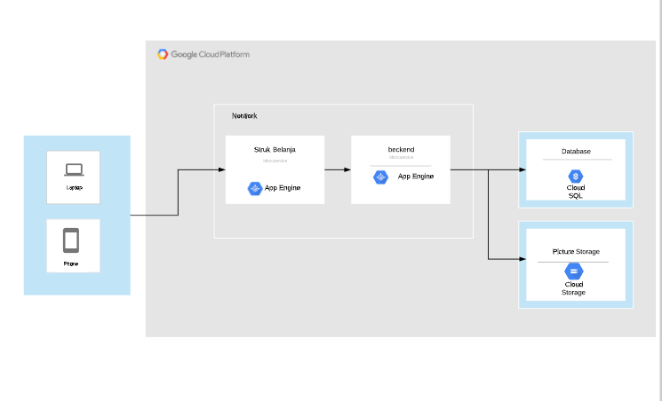
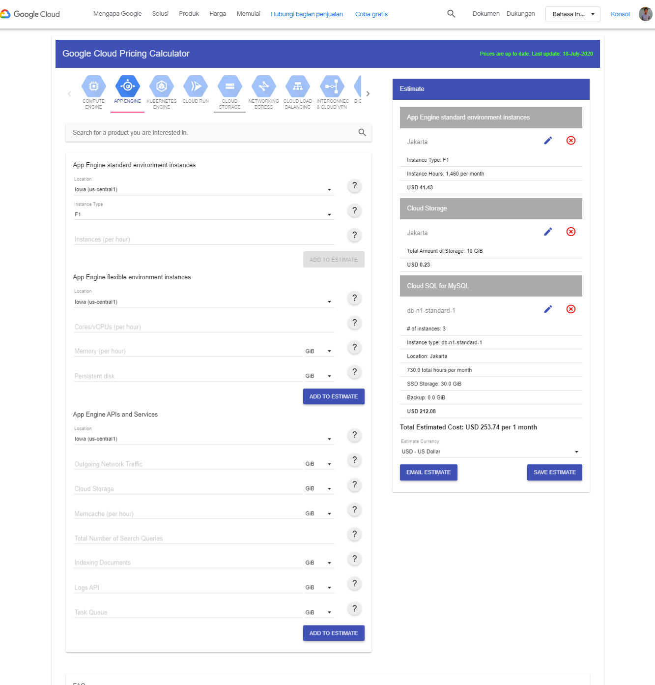
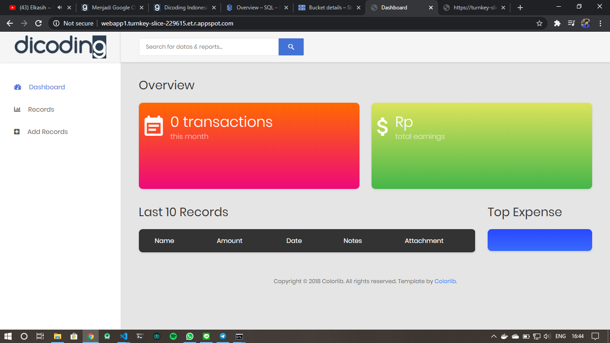
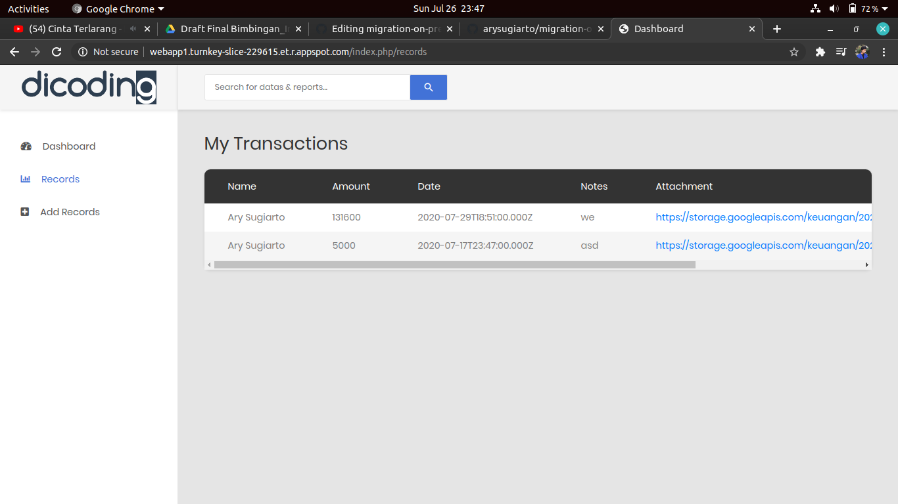
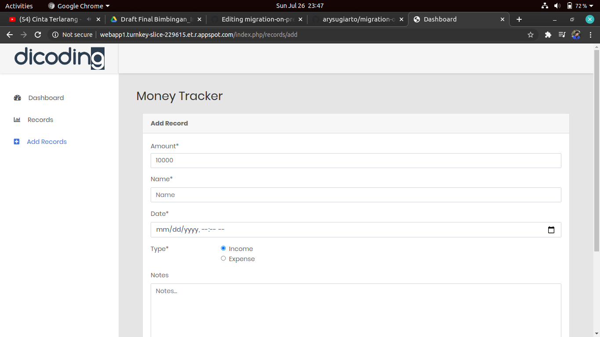

# migration-on-premise-app-to-cloud

Pada repository ini adalah Migrasi aplikasi keuangan berbasis web yang tadinya on-premise 
jadi menggunakan layanan cloud computing untuk menghemat biaya. 
dari mulai rancangan arsitektur, Calculate biaya sewa layanan, sampai deploy app ke cloud.

Layanan yang di gunakan 
# Google Cloud Platform
# App Engine
# Cloud SQL
# Cloud Storage
 
 Source code Front-end & Back-end dari Dicoding
 Front-end https://github.com/dicodingacademy/a133-gcp-labs/tree/money-tracker
 Back-end  https://github.com/dicodingacademy/a133-gcp-labs/tree/money-tracker-api
 
 

<b>Rancangan Arsitektur Cloud</b>

 

<b>Calculate biaya/ pricing</b>

 

<b>Tampilan aplikasi</b>

Link applikasi : http://webapp1.turnkey-slice-229615.et.r.appspot.com/index.php/records

